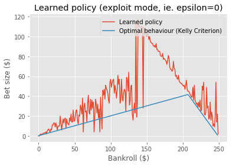

# KellyCriterionRL

A toy project I worked on while learning about Reinforcement Learning.

## What's the Kelly Criterion?

From [Wikipedia](https://en.wikipedia.org/wiki/Kelly_criterion):

The Kelly Criterion is to bet a predetermined fraction of assets and can be counterintuitive. In one study,[[5]](https://en.wikipedia.org/wiki/Kelly_criterion#cite_note-5)[[6]](https://en.wikipedia.org/wiki/Kelly_criterion#cite_note-6) each participant was given $25 and asked to bet on a coin that would land heads 60% of the time. Participants had 30 minutes to play, so could place about 300 bets, and the prizes were capped at $250. Behavior was far from optimal. "Remarkably, 28% of the participants went bust, and the average payout was just $91. Only 21% of the participants reached the maximum. 18 of the 61 participants bet everything on one toss, while two-thirds gambled on tails at some stage in the experiment." Using the Kelly criterion and based on the odds in the experiment, the right approach would be to bet 20% of the pot on each throw (see first example below). If losing, the size of the bet gets cut; if winning, the stake increases.

## What's in this repo?

The above paragraph described a bankroll management problem, gave metrics to how most humans perform at it, and presented the optimal solution.

I wondered if a reinforcement learning agent could be trained to perform better at this game than the participants of this study; or if it would work out the optimal strategy (Kelly Criterion) for itself, without being explicitly programmed.

This repo contains:

- [An implementation of the described betting game](src/environment.py). The class conforms to the [OpenAI Gym API](https://github.com/openai/gym), so can be loaded as a gym environment (however, I do not intend to publish it as a PyPI package.)

- [A Monte Carlo Q-learning agent to be trained in this environment.](src/agent.py)

- [Unit tests for both the above](tests)

- [An interface to the environment for human users](src/user_agent.py)

- [An example Jupyter notebook to run training](notebooks/train_example.ipynb)

- [Notebooks from past training runs](notebooks)

## What's the conclusion?

Every time I've run training, the agent tends to do the same thing - something roughly like this:

In particular - because the game ends at $250, any time the agent gets to a point where it could reach $250 with one bet, it always bets an amount that it could do so.

The Kelly Criterion only describes what the optimal behaviour is for an infinite number of bets and no upper limit on total winnings, so who knows what the optimal behaviour for this game _actually_ is.

Whatever the optimal behaviour is though, it doesn't seem to be this. [In a simulation of 100,000 episodes](notebooks/2019-08-07.ipynb), following the policy from the blue line drastically outperformed the trained agent (red line).

**This hasn't worked very well but in future, perhaps other RL algorithms could be used to get better results. I've only experimented with simple Monte Carlo Q-learning so far.**

## Training runs

### 7th August 2019

See [this notebook](notebooks/2019-08-07.ipynb)

### 6th August 2019

See [this notebook](notebooks/2019-08-06.ipynb)

### Older training runs

See [`old_training_runs.md`](old_training_runs.md)
