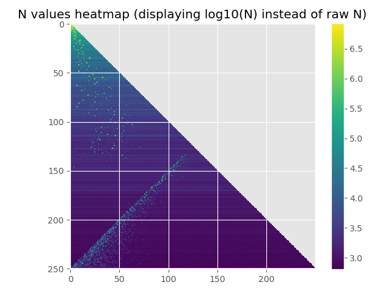
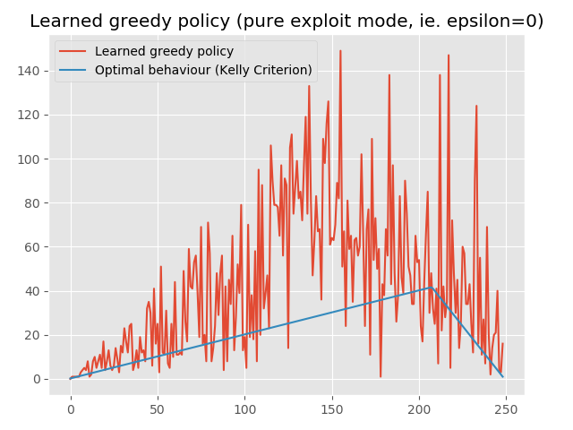

## Older training runs

### 6th August 2019 and later

See [README.md](README.md)

### 5th August 2019

After a training run of 30 million episodes, with randomly sampled starts

### 2nd August 2019

After an overnight training run of 2 million episodes

